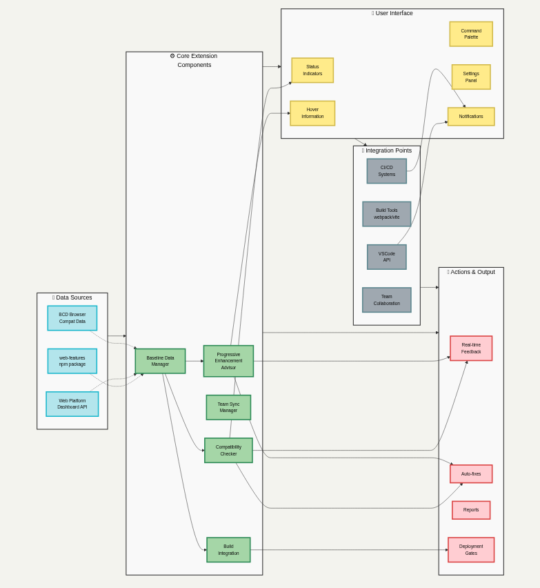

# `GroundWork` - Instant Browser-based Assurance

My submission for the [Baseline Tooling Hackathon](https://baseline.devpost.com/).

See my Devpost submission [here](https://devpost.com/gongahkia/).

## Usage

Access the live site [***here***](). The below instructions are for running it locally.

```console
$ git clone https://github.com/gongahkia/baseline-tooling-hackathon-2025
$ cd baseline-tooling-hackathon-2025 && npm install
$ npm run compile
```

## Architecture


